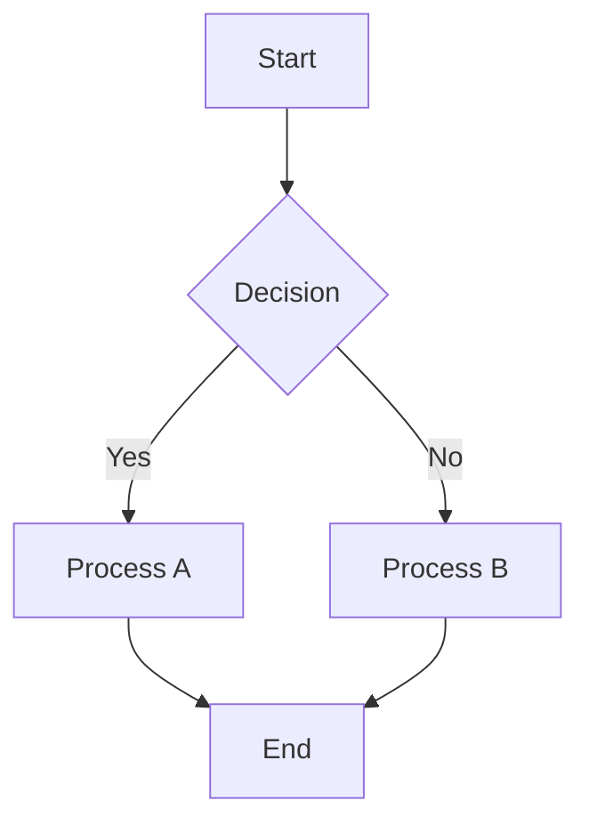
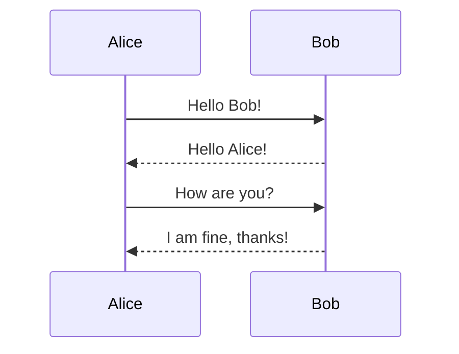
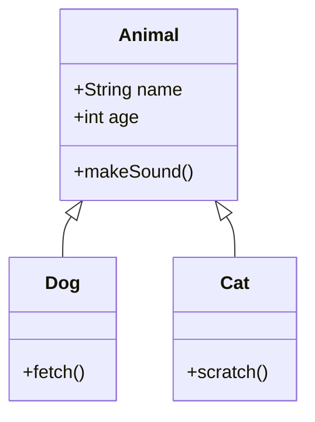
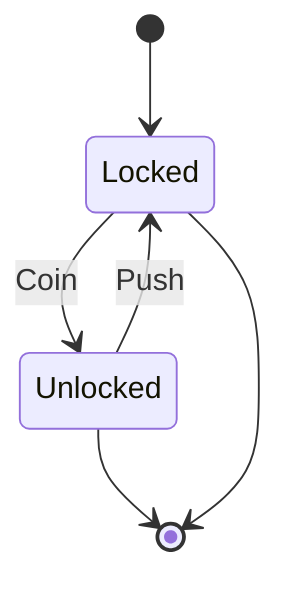
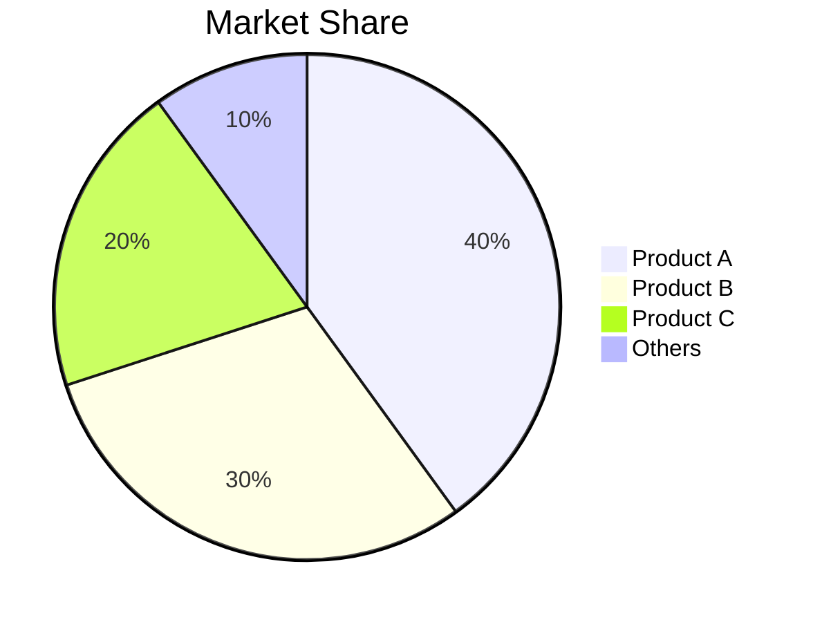
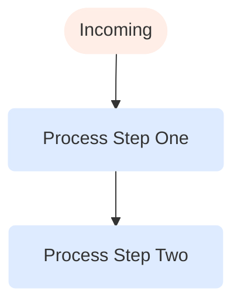
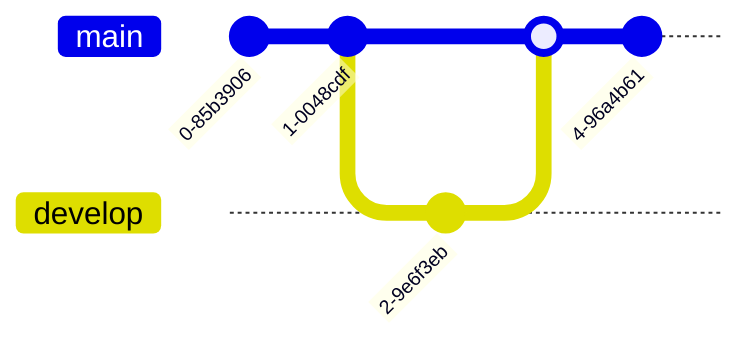
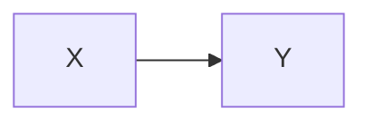
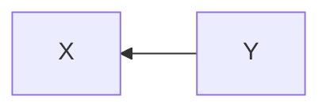

# Mermaid

Mermaid diagrams render as interactive SVG visualizations from fenced code blocks.

## Flowchart

A basic top-to-bottom flowchart with styled nodes and edges.

{#flowchart}


## Sequence Diagram

A sequence diagram showing message exchange between participants.

{#sequence}


## Class Diagram

A class diagram showing inheritance and composition relationships.

{#class-diagram}


## State Diagram

A state transition diagram for a turnstile finite state machine.

{#state-diagram}


## Pie Chart

A pie chart showing market share distribution.

{#pie-chart}


## Styled Flowchart

A flowchart with custom class definitions for node styling.

{#styled-flowchart}


## Git Graph

A git commit graph showing branch and merge history.

{#git-graph}


## Non-Mermaid Code Block

A regular JavaScript code block that should NOT be transformed as a mermaid diagram.

{#regular-code}
```javascript
const x = 42;
console.log(x);
```

## Multiple Diagrams

Two diagrams in one section to verify batch processing.

{#multiple}



