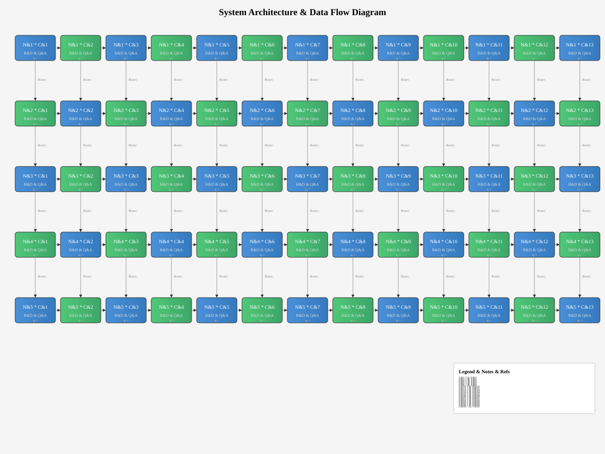
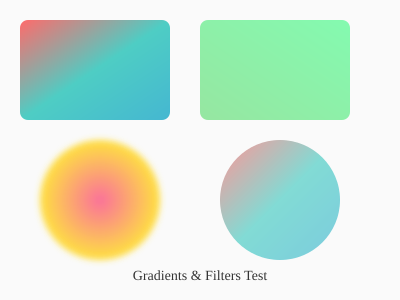
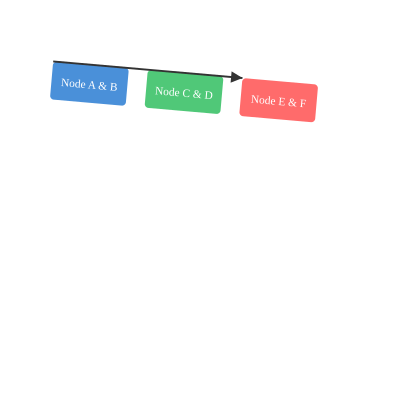
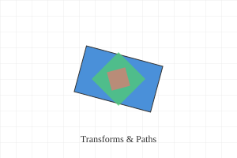

# Reproducer Fixtures

This page contains minimized reproducer fixtures collected from real regression incidents.
These fixtures are used by the `document-rendering` verification profile (T7.1) to detect
visual and structural regressions when core dependencies are updated.

## svgo Issue #2218 — Large SVG Diagram

Reproduces [svg/svgo#2218](https://github.com/svg/svgo/issues/2218): `SvgoParserError:
Parsed entity count exceeds max entity count` when processing SVG files with more than
512 XML entity references. SVGO 3.3.3+ uses `sax ^1.5.0` which defaults to
`maxEntityCount = 512`, causing valid SVG files with many entities to fail optimization.

The fixture below contains a large architecture diagram with 759+ XML entity references
(`&amp;`, `&#42;`). With svgo pinned at 3.3.2 (using `@trysound/sax`), this SVG optimizes
correctly. With svgo 3.3.3+ and sax 1.6.0, it triggers the parser error.

{#svgo-large-diagram}

{inline="true" width="600"}

### Fixture Characteristics

| Property | Value |
|----------|-------|
| File | `docs/input/assets/large-diagram.svg` |
| Size | ~45 KB |
| Entity count | 759+ |
| Nodes | 65 (5×13 grid) |
| Connectors | 113 (52 horizontal + 52 vertical + 9 legend) |
| Gradients | 2 (linearGradient) |
| Issue | [svg/svgo#2218](https://github.com/svg/svgo/issues/2218) |
| Pinned version | svgo 3.3.2 |
| Failing versions | svgo 3.3.3+ with sax 1.6.0 |

## Complex Gradients &amp; Filters

Tests svgo gradient and filter optimization. Complex SVGs with multiple gradient definitions
and filter references can produce different optimized output across svgo versions, causing
silent visual regressions.

{#complex-gradients}

### Fixture Characteristics

| Property | Value |
|----------|-------|
| File | `docs/input/assets/complex-gradients.svg` |
| Size | ~1.3 KB |
| Gradients | 3 (2 linear + 1 radial) |
| Filters | 1 (feGaussianBlur) |
| Elements | 6 (2 rects + 2 circles + 1 text + 1 background) |

## Nested Groups &amp; Transforms

Tests svgo group merging and transform optimization. Deeply nested `<g>` elements with
cumulative transforms can produce different output when svgo's `collapseGroups` plugin
changes behavior across versions.

{#nested-groups}

### Fixture Characteristics

| Property | Value |
|----------|-------|
| File | `docs/input/assets/nested-groups.svg` |
| Size | ~1.3 KB |
| Nesting depth | 6 levels |
| Transforms | 6 (translate, scale, rotate) |
| Elements | 4 rects + 3 text + 1 path |

## Transform Paths &amp; Patterns

Tests svgo path optimization and pattern handling. SVGs with complex path transforms
and pattern fills can produce different optimized output across svgo versions.

{#transform-paths}

### Fixture Characteristics

| Property | Value |
|----------|-------|
| File | `docs/input/assets/transform-paths.svg` |
| Size | ~0.9 KB |
| Patterns | 1 (grid) |
| Transforms | 3 (rotate + scale) |
| Elements | 4 paths + 1 rect + 1 text |

## Verification Integration

These fixtures are integrated into the testpack Playwright suite and used by the
following verification profiles from T7.1:

| Profile | Step | Fixtures Used |
|---------|------|---------------|
| `document-transform` | artifact-compare | All SVGs (normalized HTML diff) |
| `document-rendering` | browser-visual-regression | All SVGs (Playwright visual check) |
| `document-rendering` | svg-dom-compare | large-diagram.svg (SVG DOM structure) |
| `document-rendering` | screenshot-capture | All SVGs (screenshot diff) |
| `ecosystem` | testpack-e2e | All fixtures via testpack suite |

### Regression Detection

When a dependency update is classified for the `document-rendering` profile in any
distributed package or extension repository, the reusable deep-verification workflow:

1. Builds the reference corpus at the base SHA (expected output)
2. Builds the corpus at the PR head SHA (actual output)
3. Compares the output file tree and normalized HTML
4. Runs the Playwright visual regression suite
5. Compares SVG DOM structure for the large diagram
6. Captures and diffs screenshots

For dependency-only PRs, any golden-file diff blocks the workflow and requires investigation.
Feature PRs that intentionally change fixtures, tests, documentation, source, or workflows skip
this dependency gate and use the normal CI plus human CODEOWNER review.
